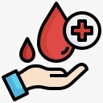

# 🩸 BloodConnect: National Blood Management System

**A modern, full-stack web application designed to streamline blood management, connecting donors, patients, and blood banks across the nation. 🇮🇳**

[](https://github.com/naskarmourique/Blood-Bank-management-System-/stargazers)
[](https://opensource.org/licenses/MIT)

---

<p align="center">
  
</p>

---

## 📖 Table of Contents

- [🚀 Mission](#-mission)
- [✨ Key Features](#-key-features)
- [📸 Screenshots](#-screenshots)
- [🛠️ Tech Stack](#️-tech-stack)
- [📂 Project Structure](#-project-structure)
- [⚡ Getting Started](#-getting-started)
- [🤝 How to Contribute](#-how-to-contribute)
- [📄 License](#-license)

---

## 🚀 Mission

Our mission is to **save lives** by creating a seamless and efficient ecosystem for blood management. BloodConnect bridges the gap between donors and recipients, ensuring that safe blood is available to anyone in need, anytime, anywhere.

---

## ✨ Key Features

| Feature                 | Description                                                                                                                              | Status |
| ----------------------- | ---------------------------------------------------------------------------------------------------------------------------------------- | :----: |
| 📊 **Admin Dashboard**      | Real-time overview of inventory, requests, and events.                                                                                   |   ✅   |
| 🩸 **Donor & Patient Forms**  | Easy-to-use forms for donor registration and urgent blood requests.                                                                     |   ✅   |
| 🎉 **Blood Drive Events**    | Create, manage, and join blood donation events.                                                                                          |   ✅   |
| stock **Inventory Management** | Track blood units by group, manage stock levels, and get low-stock alerts.                                                            |   ✅   |
| 💬 **Feedback System**      | Collect valuable feedback from users to improve the system.                                                                              |   ✅   |
| 📞 **Contact & Support**    | Emergency helplines and contact forms for immediate assistance.                                                                         |   ✅   |
| 📱 **Responsive Design**    | Fully responsive UI built with Bootstrap 5, ensuring a great experience on any device.                                                  |   ✅   |

---

## 🛠️ Tech Stack

| Category   | Technology                                                                                                                                                                                                                                                                                                                             |
| ---------- | -------------------------------------------------------------------------------------------------------------------------------------------------------------------------------------------------------------------------------------------------------------------------------------------------------------------------------------- |
| **Frontend** |     |
| **Backend**  |                                                                                                                                                                                                                                               |
| **Database** |                                                                                                                                                                                                                                           |

---

## 📂 Project Structure

```
Blood-Bank-management-System-/
├── 📂 css/                 # CSS files
├── 📂 js/                  # JavaScript files
├── 📂 images/              # Image assets
├── 📄 connect.php          # Database connection
├── 📄 landing_page.php      # Main landing page
├── 📄 login.php             # Login page
├── 📄 blood_request.php     # Blood request form
├── 📄 blood_donor_form.php  # Donor registration form
├── 📄 ...and many more PHP files for backend logic
```

---

## ⚡ Getting Started

### Prerequisites

- A local web server environment like [XAMPP](https://www.apachefriends.org/index.html) or [WAMP](https://www.wampserver.com/en/).

### Installation

1.  **Clone the repository:**
    ```bash
    git clone https://github.com/naskarmourique/Blood-Bank-management-System-.git
    ```
2.  **Move the project** to your web server's root directory (e.g., `htdocs` for XAMPP).
3.  **Create the database:**
    -   Go to `http://localhost/phpmyadmin`.
    -   Create a new database named `blood_connect`.
    -   Import the `blood_connect.sql` file into the database.
4.  **Access the application** at `http://localhost/Blood-Bank-management-System-/landing_page.php`.

---

## 🤝 How to Contribute

Contributions are what make the open-source community such an amazing place to learn, inspire, and create. Any contributions you make are **greatly appreciated**.

1.  **Fork the Project**
2.  **Create your Feature Branch** (`git checkout -b feature/AmazingFeature`)
3.  **Commit your Changes** (`git commit -m 'Add some AmazingFeature'`)
4.  **Push to the Branch** (`git push origin feature/AmazingFeature`)
5.  **Open a Pull Request**

We're excited to see your contributions! 🎉

---

## 📄 License

Distributed under the MIT License. See `LICENSE` for more information.
